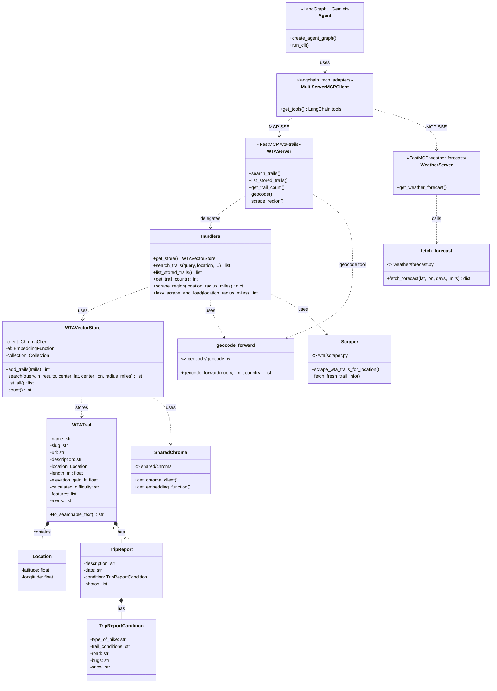
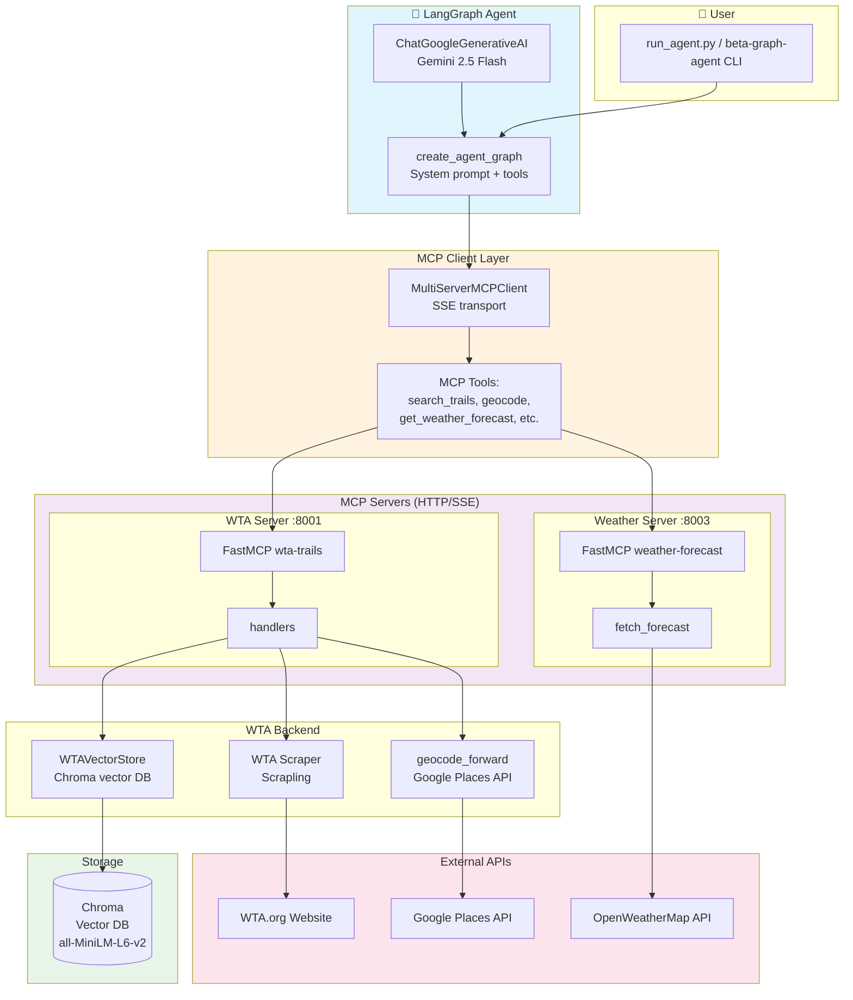
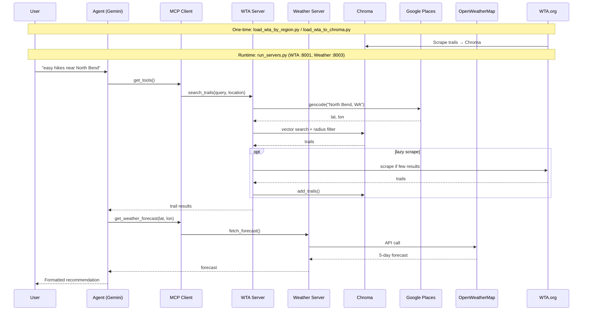

# BetaGraph Diagrams

## 1. UML Class Diagram

Class structure and relationships across BetaGraph modules:

---

## 2. Architecture Mermaid Diagram

High-level system architecture, data flow, and deployment:

---

### Deployment / Data Flow Sequence

---

### Component Overview

| Component | Technology | Role |
|-----------|------------|------|
| Agent | LangGraph + Gemini | Natural-language hiking planner |
| MCP Client | langchain-mcp-adapters | Connects agent to MCP servers via SSE |
| WTA Server | FastMCP | Trail search, geocode, lazy scrape |
| Weather Server | FastMCP | 5-day forecast |
| Chroma | Vector DB | Semantic search over trails |
| Embeddings | all-MiniLM-L6-v2 | Local sentence-transformers |
| Geocode | Google Places API | Place name → coordinates |
| Scraper | Scrapling (Fetcher) | WTA trail pages |
| Weather | OpenWeatherMap | Forecast data |
